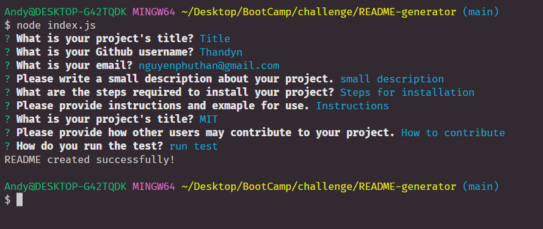

# README-generator

For this week's challenge, we had to make a README-generator. 

For this section of code, I made a function to generate and render the README file. I used template literals to write and format.

These are the prompts I've made. All the prompts are put in as an object and the user's response will fill in the variable and make the file under sampleREADME.md

When user opens the terminal and type in "node index.js", the prompt will show up just like the screenshot shows. 

link to walkthrough video https://drive.google.com/file/d/1NhMzhi-FEIZCHzbSmmuyOvDFjXXhbmHs/view